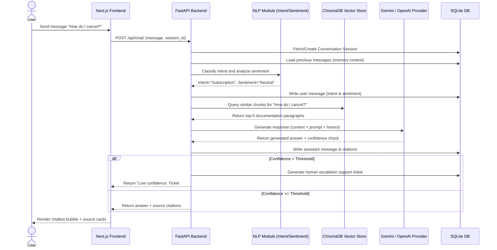

# CloudFlow AI Support Assistant System Architecture

This document describes the technical architecture and information flow of the CloudFlow AI Support Assistant (V1.0).

## System Flow Overview

The diagram below details the components involved when a user submits a chat message:

## Key Components

### 1. Backend Service (FastAPI)
The application core that handles routing, database connections, and coordinating LLM and NLP operations.

### 2. Retriever & Vector Database (ChromaDB)
Maintains high-dimensional semantic indexing of CloudFlow help center documents. Queries are mapped to dense vector spaces using Google or OpenAI embeddings.

### 3. NLP Processors
- **Intent Classifier**: Maps messages to specific categories for ticket routing.
- **Sentiment Analyzer**: Captures user urgency or sentiment.
- **Confidence Scorer**: Checks average retrieval scores to confirm grounded answers.

### 4. Memory Store (SQLite via SQLAlchemy)
Maintains persistence for chat histories and created support tickets.
