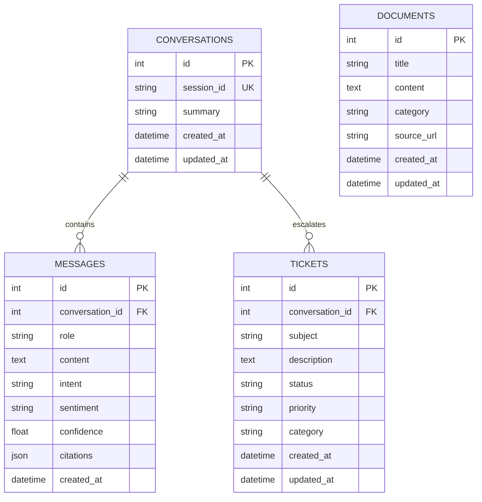

# CloudFlow AI Support Assistant Database Schema

This document details the database schema stored in the local SQLite engine (`cloudflow.db`).

## Entities

### Table Details

1. `conversations`: Stores conversational session logs.
2. `messages`: Single message objects (user, system, or AI responses). Handles metadata generated by NLP pipelines (sentiment, intents, and RAG search citation snippets).
3. `tickets`: Tracks escalated tickets if the scorer outputs low confidence.
4. `documents`: Tracks raw ingested help articles.
